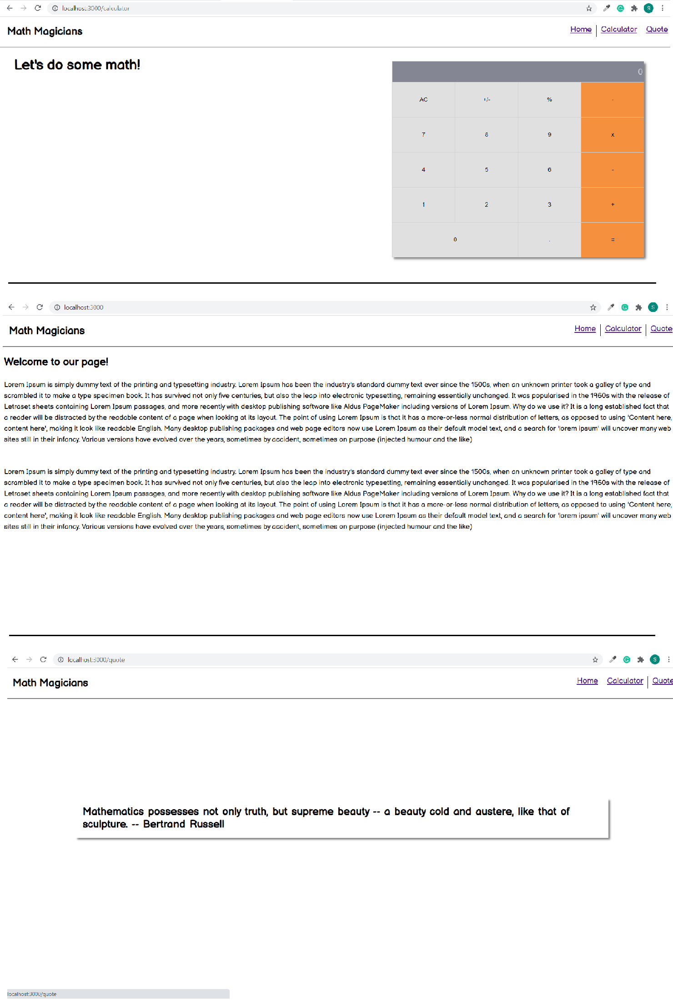

# Math Magicians

> "Math magicians" is a website for all fans of mathematics. It is a Single Page App (SPA) that allows users to make simple calculations and read a random math-related quote.

## Built With

- React

## Live Demo
Visit the live link [here](https://tedlivist.github.io/math-magicians/)

## Getting Started

### Setup

#### To get a local copy up and running follow these simple example steps.

- Click the green `Code` button on the repo
- In your local PC, open your terminal in the folder you would like to clone the project.
- Clone the repo with the command: `git clone (copied link)`; like so: `git clone https://github.com/TedLivist/math-magicians.git`
- On the terminal, navigate into the directory like so: `cd math-magicians`
- Checkout to branch name like so: `git checkout [branch name]`
- Run `npm i` or `yarn` to install the dependencies
- Run `npm start` or `yarn start` to start the application

## Author

👤 **Teddy-Livingstone Ememandu**

- [GitHub](https://github.com/TedLivist)
- [LinkedIn](https://linkedin.com/in/tememandu)

## 🤝 Contributing

Contributions, issues, and feature requests are welcome!

Feel free to check the [issues page](../../issues/).

## Show your support

Give a ⭐️ if you like this project!

## Acknowledgments

- Hat tip to anyone whose code was used
- Inspiration
- etc